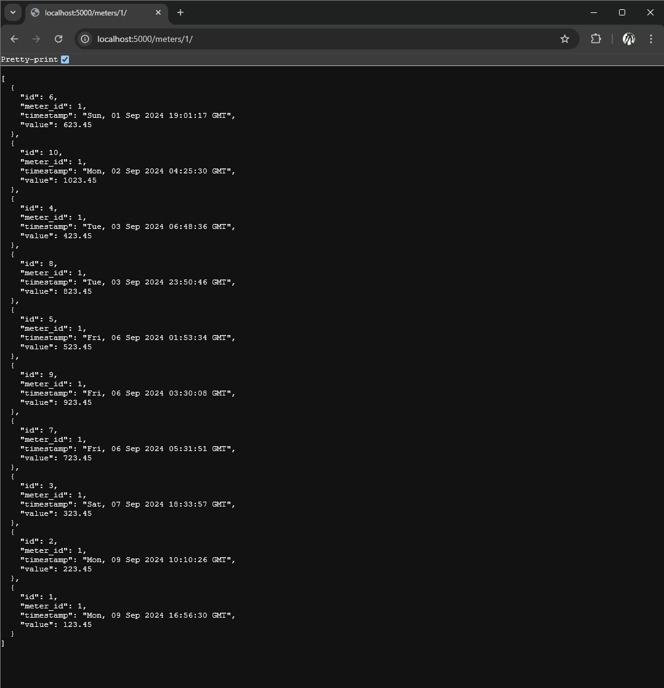

# Project Title

LBS Coding Challenge

## Description

Backend API endpoints to fetch the available meters and their corresponding data in sorted order.

### Dependencies

* Docker
* Git(optional)

### Installing

* Clone the repository from [@TestRepo](https://github.com/skashifzafar/LBS_Test)

### Executing program

```
docker compose up
```
* URL Endpoints:
    * Meters: http://127.0.0.1:5000/meters/
        * 
    * Meter Details: http://127.0.0.1:5000/meters/{meter_id}/
        * 

## Authors
[@Syed Kashif Zafar](https://www.linkedin.com/in/skashifzafar/)
